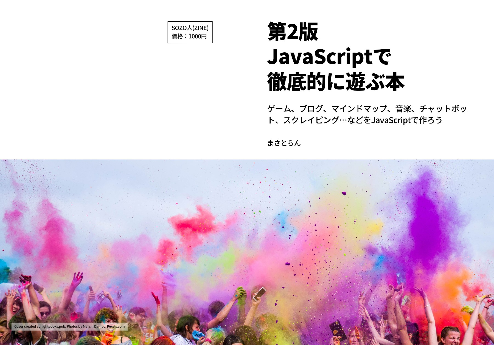

# 【第2版】JavaScriptで徹底的に遊ぶ本 ＜サポートサイト＞

## 本書について

- JavaScriptの基本的な学習を終了した人
- 初心者から中級者にステップアップしたい人
- JavaScriptでいろんなWebアプリを作りたい人
- とにかくJavaScriptが好きな人

本書は上記のような人にオススメできる「作って勉強する」スタイルの本になります。

今回は第2版として全面的に前著を見直したうえで、図解などを追加してより分かりやすさを重視しました。古くなった情報を改訂して新しい章の追加を行い初心者でもJavaScriptで「何かを作る！」ことに特化した内容になっております。

本書を読むことで、ブックマークレット、ゲーム、音楽、ブログ、マインドマップ、チャットボット、スクレイピング…など、さまざまなジャンルのWebアプリをライブラリやWebサービスなどを駆使して誰でも開発できるようになります。

★販売ページ：https://masatolan.booth.pm/items/1966871

## サポートサイトについて

本書に掲載しているサンプルコードやダウンロードファイルなどをすべてまとめています。

ソースコードは独自プロジェクト、勉強会などなど…自由にご利用頂いて問題ありません。

